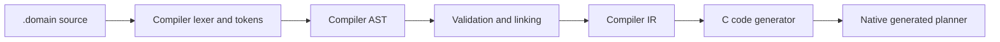

# HTN Planner

HTN Planner is a C++ hierarchical task network planner for game AI. Domains are
written in a small declarative language and translated ahead of time into native C.
The runtime executes the generated planner directly and does not parse domain source
during gameplay.

The repository includes:

- The generated planner runtime and its C ABI.
- A C++ integration layer with planner hooks and planning units.
- `HTNTranslator`, which validates domains and emits C source.
- A visual SDL and ImGui demo with generated execution debugging.
- An editor, language server, hot reload example, tests and benchmarks.
- A packageable Windows x64 SDK with CMake integration.

The current stable version is **1.1.0**. The generated planner and runtime bridge
ABIs are versioned and validated at runtime.

## Domain example

```lisp
(:domain GuardNPC top_level_domain

    (:method (run) top_level_method
        (patrol
            (and
                (guard_on_duty)
            )
            (
                (!move_to "checkpoint")
                (!scan_area)
            )
        )
    )
)
```

A successful decomposition returns a plan containing the primitive tasks
`!move_to` and `!scan_area`. The engine assigns meaning to those tasks and decides
when they start, complete or fail.

## Requirements

- Windows x64.
- Visual Studio 2022 with the Desktop development with C++ workload.
- MSVC v143 and a Windows SDK.
- C++20 for clients and C11 for generated domain source.
- CMake 3.25 or newer when consuming the packaged SDK through CMake.

Premake, SDL, Dear ImGui, GoogleTest and the remaining development dependencies are
included in the repository.

## Build and run the visual demo

Generate the Visual Studio solution from the repository root:

```bat
GenerateProjectFiles.bat
```

Build `HTN.sln` for x64. Use `Debug` to include generated decomposition capture and
the visual debugger. Use `Release` for an optimized runtime build without debugger
instrumentation.

Run:

```text
bin/<configuration>-windows-x86_64/HTNDemo/HTNDemo.exe
```

The generated-only HTNDemo provides three views:

- **Domain Runner** selects a compiled domain, top-level method, backtracking mode and
  world state. It displays the resulting primitive plan.
- **Generated event debugger** displays the executed hierarchy, backtracking choices,
  source locations, constants and bound variables in instrumented builds.
- **NPC Simulation** runs a generated planner as part of a small agent simulation.

The demo loads world-state data for inspection, but its domain definitions are already
compiled into native generated planners.

## Compiler pipeline



1. `HTNCompilerDomainLexer` creates tokens and source ranges.
2. `HTNCompilerDomainSyntaxParser` creates the compiler-owned AST.
3. Validation and linking resolve declarations, includes, overrides and references.
4. `HTNCompilerIRBuilder` lowers the linked domain into compiler IR.
5. `HTNCCodeGenerator` emits C source and static metadata.
6. The client build compiles that C source into the game or a domain module.

The AST and IR are build-time representations. Generated runtime execution does not
retain or depend on them. See [Compiler pipeline and IR boundary](docs/COMPILER_IR.md).

## Translate a domain

Build `HTNTranslator`, then validate a domain without producing output:

```bat
HTNTranslator.exe --check path\to\npc.domain
```

Generate C for an exported entry point:

```bat
HTNTranslator.exe path\to\npc.domain CreateNpcHTN generated
```

The generated source exports:

```cpp
extern "C" const HTNGeneratedPlannerDefinition* CreateNpcHTN_GetDefinition(void);
```

Useful translation options are:

```text
--backtracking-policy=fixed-with-overflow|fixed-capacity
--backtracking-capacity=<positive integer>
--runtime-backtracking-support=disabled|enabled
```

Compile generated C with the same configuration definitions and ABI as the runtime.
Regenerate domain source whenever the generated planner ABI changes.

## Integrate with a C++ engine

The simplest integration uses `HTNIntegration`, which supplies `HTNPlannerHook`,
`HTNPlanningUnit` and `HTNDatabaseHook`:

```cpp
#include "HTNIntegration.h"

extern "C" const HTNGeneratedPlannerDefinition* CreateNpcHTN_GetDefinition(void);

HTNDatabaseHook Database;
HTNCallTermRegistry CallTerms;
HTNPlannerHook Planner(Database.GetWorldState(), CallTerms);

if (!Planner.SetGeneratedPlannerDefinition(CreateNpcHTN_GetDefinition()))
    return false;

HTNPlanningUnit Unit(Database, Planner, HtnSymbol::sGetSymbol("run"));
const HTNDecompositionStatus Status = Unit.DecomposeTopLevelMethod();
```

After a successful decomposition, use `ResolveCurrentPrimitiveTask()` and
`GetCurrentPrimitiveTask()` to inspect the next action. Call
`CompleteCurrentPrimitiveTask()` after the engine finishes that action. The engine
owns action dispatch, replanning policy, scheduling and world-state updates.

Call terms connect domain expressions to engine functions through
`HTNCallTermRegistry` and `HTNCallTermBindingContext`. The packaged
`IntegrationConsumer` and `CoreConsumer` examples demonstrate the optional integration
layer and the lower-level runtime API respectively.

## Generated execution debugger

Instrumented builds can capture generated execution without changing planner logic:

```cpp
#ifdef HTN_DEBUG_DECOMPOSITION
HTNGeneratedDebugger Debugger;
Debugger.SetEnabled(true);
Unit.SetGeneratedDebugger(&Debugger);
#endif
```

The debugger records methods, branches, conditions, axioms, tasks, results, source
ranges and scoped values. Its data model is independent of ImGui; an engine can render
the captured nodes in its own editor. HTNDemo includes an ImGui reference view.

The application owns the debugger object. Instrumented generated domains and their
host runtime must use matching ABI definitions. See
[Generated execution debugger](docs/GENERATED_DEBUGGER.md).

## SDK package

To build and validate all supported SDK variants:

```bat
BuildAndValidateSDK.bat
```

This command:

1. Generates `HTNSDK.sln`.
2. Builds the eight CRT, configuration and instrumentation variants.
3. Creates a versioned directory and ZIP under `dist`.
4. Extracts the package outside the source tree.
5. Builds and runs its core, integration and dynamic-domain consumers.

To generate only the SDK solution:

```bat
GenerateSDKProjectFiles.bat
```

The package exports CMake targets for `HTNFramework`, `HTNIntegration`,
`HTNRuntimeBridge` and `HTNTranslator`. Choose an SDK variant that matches the engine's
CRT and instrumentation settings. See [SDK variants](docs/SDK_VARIANTS.md) and
[SDK distribution](docs/DISTRIBUTION.md).

## Repository layout

| Path | Purpose |
| --- | --- |
| `HTNFramework` | Core data types, world state, compiler frontend, IR, code generator and generated runtime. |
| `HTNIntegration` | Optional C++ engine integration and active-plan handling. |
| `HTNRuntimeBridge` | Optional bridge for dynamically loaded generated domain modules. |
| `HTNTranslator` | Command-line domain validator and C source generator. |
| `HTNDemo` | SDL and ImGui generated planner demo. |
| `HTNHotReloadDemo` | Example generated-domain DLL compilation and hot reload flow. |
| `HTNEditor` | Domain authoring tool. |
| `HTNLanguageServer` | Diagnostics and language tooling backend. |
| `HTNVSCode` | VS Code extension client. |
| `HTNTest` | Runtime, compiler, integration and regression tests. |
| `HTNBenchmark` | Generated planner benchmarks. |
| `Domains` | Example domains, includes and inheritance hierarchies. |
| `WorldStates` | Example world-state inputs used by demos and tests. |
| `SDK` | Packaging, CMake configuration and external consumer validation. |
| `docs` | Architecture, debugger, SDK distribution and release documentation. |

## Validation

Build `HTNTest` and run its executable from the `HTNTest` directory so relative test
assets resolve correctly:

```bat
..\bin\Release-windows-x86_64\HTNTest\HTNTest.exe
```

The test suite covers compiler diagnostics, AST and IR behavior, generated planning,
backtracking, includes, overrides, call terms, lists, ABI validation, dynamic modules,
concurrency and the public integration API.

See [CI validation](CI.md) for the repository build matrix.

## Documentation

The [documentation index](docs/README.md) links the compiler architecture,
generated debugger, SDK distribution and release guides. See
[CONTRIBUTING.md](CONTRIBUTING.md) for development workflow and
[CHANGELOG.md](CHANGELOG.md) for release history.

## Contributors

The generated planner, compiler pipeline and public release are developed and
maintained by [Jose Antonio Escribano](https://github.com/urosidoki). The shared
2023 foundation retained in the core, parsing, world-state and integration layers
was co-authored with [Sandra Alvarez](https://github.com/Sandruski).

See [CONTRIBUTORS.md](CONTRIBUTORS.md) and [NOTICE.md](NOTICE.md) for contributor
credits and formal copyright attribution.

## Third-party software

- [SDL](https://www.libsdl.org)
- [Dear ImGui](https://github.com/ocornut/imgui)
- [GoogleTest](https://google.github.io/googletest)
- [Premake](https://premake.github.io)
- [Optick](https://github.com/bombomby/optick)

Applicable notices are included when producing an SDK package.

## References

- [Exploring HTN Planners through Example](https://www.gameaipro.com/GameAIPro/GameAIPro_Chapter12_Exploring_HTN_Planners_through_Example.pdf)
- [The AI of Horizon Zero Dawn](https://www.guerrilla-games.com/read/the-ai-of-horizon-zero-dawn)
- [Hierarchical AI for Multiplayer Bots in Killzone 3](https://www.gameaipro.com/GameAIPro/GameAIPro_Chapter29_Hierarchical_AI_for_Multiplayer_Bots_in_Killzone_3.pdf)

## License

Licensed under the [MIT License](LICENSE). See [copyright and attribution](NOTICE.md)
and [third-party notices](THIRD_PARTY_NOTICES.md) before redistributing binaries or
SDK packages.
