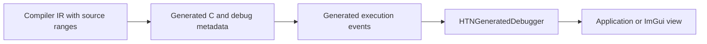

# Generated execution debugger

`HTNGeneratedDebugger` records the execution of native generated planners as a tree
of structured events. It consumes source metadata emitted by the compiler.

## Data flow



The generated metadata maps runtime indexes back to methods, branches, conditions,
axioms, tasks, constants and source ranges. During planning, generated code reports
begin and end events. `HTNGeneratedDebugger` turns those events into nodes containing:

- Parent and child relationships.
- Started, completed and succeeded state.
- Domain file, line and column ranges.
- Display tokens for the executed expression.
- Constants referenced by the event.
- Bound variables before and after the event.
- Historical alternatives created by backtracking and retries.

## Build configuration

The runtime, generated domain and consuming application must be built with
`HTN_DEBUG_DECOMPOSITION` to expose debug metadata and event capture. This changes the
generated planner ABI, so modules and their host must use matching configurations.
Regenerate and rebuild domain code after changing this setting.

The repository's `Debug` configuration enables the feature. Instrumented SDK variants
also enable it. Release and ordinary Profile configurations omit the metadata and
capture overhead.

## Attaching a debugger

The application owns the debugger and must keep it alive while the planning unit can
use it:

```cpp
#ifdef HTN_DEBUG_DECOMPOSITION
HTNGeneratedDebugger GeneratedDebugger;
GeneratedDebugger.SetEnabled(true);
PlanningUnit.SetGeneratedDebugger(&GeneratedDebugger);
#endif
```

`HTNPlanningUnit` passes the pointer through the generated execution context. Before
each generated decomposition, `HTNPlannerHook` resets the capture and supplies the
source file from the active planner definition. Planning then populates the event tree
synchronously. The application can read `GetNodes()`, `FindNode()` and `GetRevision()`
after the call completes.

The pointer is non-owning. Detach it or ensure the planning unit is destroyed before
the debugger object goes out of scope.

## Visual presentation

`HTNDemo/src/UI/HTNGeneratedDebuggerView.h` is the ImGui reference renderer. It shows
the captured hierarchy, successful and failed alternatives, retry counts, source
locations, constants and bound variables. Normal mode projects the event stream into
a concise planning view; verbose mode exposes the underlying event hierarchy.

The view is deliberately separate from capture. An integration can render the same
`HTNGeneratedDebugger::Node` data in an engine editor, telemetry tool or custom UI
without linking its planner execution to ImGui.

## Runtime boundary

The debugger observes generated execution through the generated runtime bridge. It
does not evaluate conditions, choose branches or affect backtracking. Disabling the
debugger removes captured state but does not change planning results.
